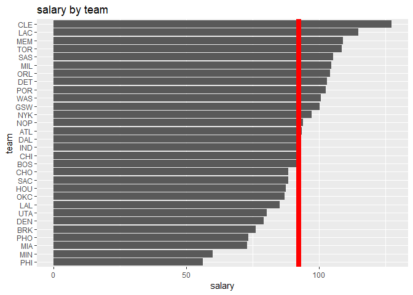
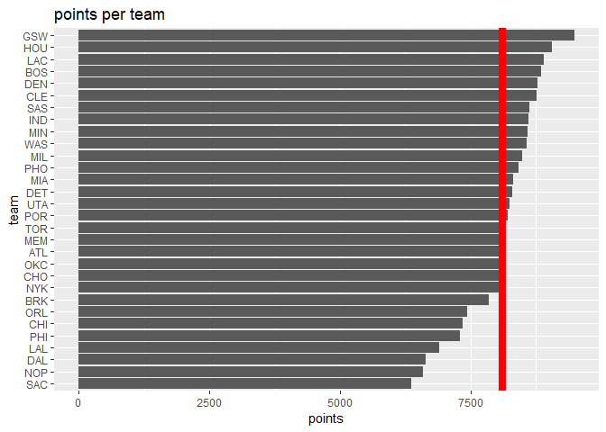
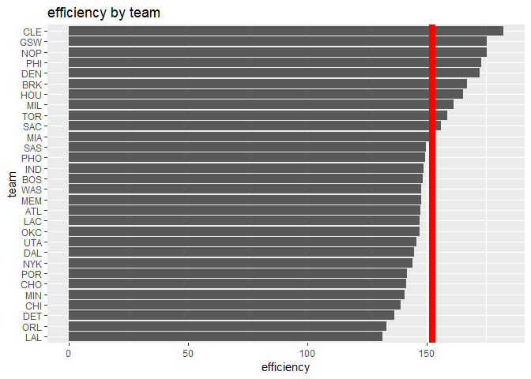
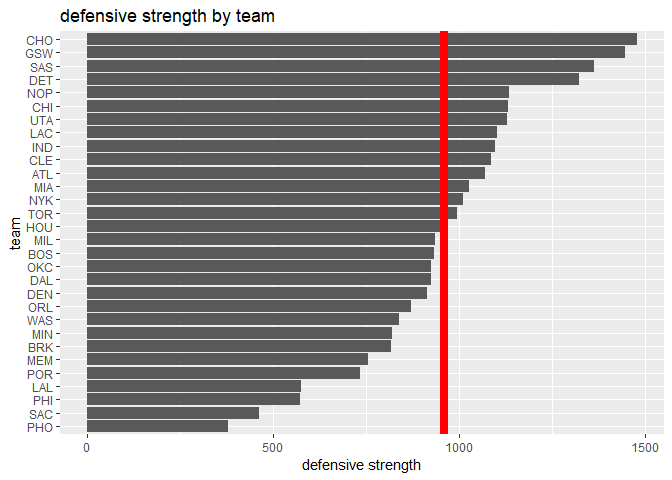

workout01-renuka-garg
================
Renuka Garg
October 1, 2018

``` r
teams <- read.csv("../data/nba2018-teams.csv")

library(dplyr)
```

    ## 
    ## Attaching package: 'dplyr'

    ## The following objects are masked from 'package:stats':
    ## 
    ##     filter, lag

    ## The following objects are masked from 'package:base':
    ## 
    ##     intersect, setdiff, setequal, union

``` r
dat <- arrange(teams, desc(salary))

library(ggplot2)

avgsal <- mean(dat$salary)
avgsal
```

    ## [1] 92.28933

``` r
ggplot(dat, aes(x = reorder(team, salary), y = salary)) +
  geom_bar(stat = 'identity') +
  geom_hline(yintercept = avgsal, size = 3, color = "red") +
  xlab("team") + ylab("salary") + ggtitle("salary by team") +
  coord_flip()
```



``` r
avgpts <- mean(dat$points)
ggplot(dat, aes(x = reorder(team, points), y = points)) +
  geom_bar(stat = 'identity') +
  geom_hline(yintercept = avgpts, size = 3, color = "red") +
  xlab("team") + ylab("points") + ggtitle("points per team") + 
  coord_flip()
```



``` r
avgeff <- mean(dat$efficiency)
ggplot(dat, aes(x = reorder(team, efficiency), y = efficiency)) +
  geom_bar(stat = 'identity') +
  geom_hline(yintercept = avgeff, size = 3, color = "red") +
  xlab("team") + ylab("efficiency") + ggtitle("efficiency by team") + 
  coord_flip()
```



``` r
index <- dat$def_rebounds + dat$steals + dat$blocks - dat$turnovers - dat$fouls
dat <- mutate(dat, index)
# index measuring defensive power of team
avgindex <- mean(dat$index)
ggplot(dat, aes(x = reorder(team, index), y = index)) +
  geom_bar(stat = 'identity') +
  geom_hline(yintercept = avgindex, size = 3, color = "red") +
  xlab("team") + ylab("defensive strength") + ggtitle("defensive strength by team") +
  coord_flip()
```



### Comments and Reflections

-   This was my first time working with this kind of file structure. I did not have too hard of a time navigating the structure.
-   It was my first time using relative paths. Relative paths are important if you change the directory of your main project folder because you still want your code to be able to find all the inputs.
-   We have used R script in lab before. It is not much different from writing in chunks in R Markdown.
-   It was extremely difficult to get the data all formatted properly, even though we've worked on that in other labs.
-   Navigating ggplot and creating the actual Rmd file was very simple.
-   I talked out some strategy with a classmate (Joey Kratz).
-   It took me about 7 hours to complete this homework.
-   The most time consuming part was cleaning the data.
-   The most interesting part was the creation of the plots at the end.
